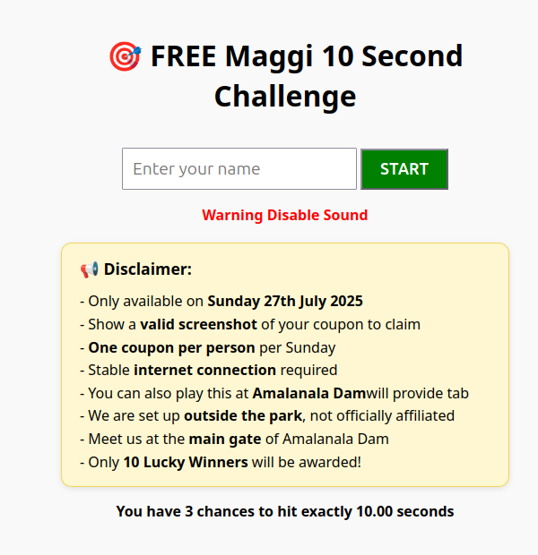

# 🍜 Maggi 10 Second Challenge (v1.0)

A fun web-based game where users try to stop a timer **exactly at 10.00 seconds** to win a free Maggi plate! Built with HTML, JavaScript, and PHP for a self-hosted environment.



---

## 🎮 Game Rules

- You get **3 chances per day** to stop the timer at **exactly 10.00 seconds**
- Winners receive a **coupon QR code**
- Game is hosted and playable only on specific days/events (e.g. Sunday, 27th July 2025)
- Users must **enter a valid name** and cannot play in **Incognito Mode**
- Each device is restricted to **3 plays per day** via fingerprint tracking

---

## 🔐 Features

- Fingerprint-based device tracking (via [FingerprintJS](https://fingerprint.com))
- **Profanity filter** on user input (supports English, Hindi, Marathi slang)
- **Confetti animation**, sound effects, and win modal for winners
- QR Code generation for winner coupons using [QRCode.js](https://github.com/soldair/node-qrcode)
- Backend scripts for:
  - Saving game data (`save.php`)
  - Viewing leaderboard (`leaderboard.php`)
  - Tracking visits (`track_visitor.php`)
  - Admin panel (`admin.php`)
- DEV mode support and configurable restrictions

---

## ⚙️ How to Deploy

1. **Upload files to your server** with PHP and HTTPS support
2. Update `db_cred_mag.php` with your **MySQL credentials**
3. Ensure the following backend files are present:
   - `save.php`
   - `leaderboard.php`
   - `track_visitor.php`
   - `admin.php`
   - `db_cred_mag.php`
4. ✅ Required Libraries (auto-loaded via CDN):
   - `@fingerprintjs/fingerprintjs`
   - `canvas-confetti`
   - `qrcode`

---

## 📂 Project Structure

```

/project-root
│
├── index.html                # Main Game UI
├── save.php                  # Handles game save (JSON POST)
├── leaderboard.php           # Leaderboard + Winner tracking
├── track\_visitor.php         # Tracks page hits
├── admin.php                 # Admin dashboard
├── db\_cred\_mag.php           # DB credentials (included in PHP files)
├── win.mp3 / alert.mp3       # Sound effects
├── win\_firework.mp3          # Optional firework sound
└── README.md

````

---

## 🛠 Configurable Options (in index.html)

```js
const ENFORCE_SINGLE_DEVICE = 'Y'; // Toggle fingerprint restriction
const DEV_MODE = false; // DEV mode skips restrictions and clears storage
const WHITELISTED_FINGERPRINTS = ["test_fp_123456"]; // Allowed unlimited plays
````

---

## 📊 Database Schema (MySQL)

```sql
CREATE TABLE game_results (
  id INT AUTO_INCREMENT PRIMARY KEY,
  name VARCHAR(100),
  time FLOAT,
  status VARCHAR(20),
  played_at TIMESTAMP DEFAULT CURRENT_TIMESTAMP,
  fingerprint VARCHAR(64),
  winner_id VARCHAR(20)
);

CREATE TABLE visitor_logs (
  id INT AUTO_INCREMENT PRIMARY KEY,
  fingerprint VARCHAR(64),
  visit_date DATE,
  created_at TIMESTAMP DEFAULT CURRENT_TIMESTAMP
);
```

---

## 🔒 Security Notes

* Profanity filter blocks inappropriate names
* All POST requests use `application/json`
* Fingerprint tracking prevents replay abuse
* Coupon code shown only to winners

---

## 📅 Launch Info

> This version is configured to go LIVE on:
> Saturday, 26th July 2025**

---

## 👨‍💻 Author

Created by [Sunil Jeurkar](https://github.com/suniljeurkar)
With ❤️ to add fun, fairness, and tech to local events

---

## 📄 License

This project is released under the [MIT License](LICENSE)

```


